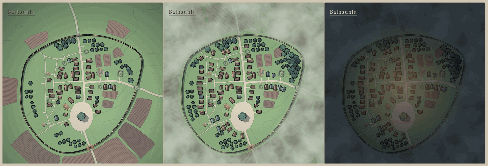

# Village map demo

Two static pages that run the system's village code in the browser.
**[Live demo →](https://dimitroffvodka.github.io/crows_playtest/)**



## `index.html` — Balhaunis

The village the system actually ships. The map is authored: roads, ground, and
the position, size and facing of every plot are frozen in
[`canonical-village-layout.mjs`](../module/helpers/canonical-village-layout.mjs)
— 12 institution slots, 69 homes, 22 fields, 77 pieces of dressing.

What varies is only how much of it is standing, and
[`buildVillageProjection()`](../module/helpers/village-map.mjs) decides that:

- **Institutions** — a founded one gets its authored art, an unfounded one gets
  `unbuilt-plot.svg` on the plot being held for it. The slot never moves.
- **Levels** — raising an institution enlarges its building. The authored set is
  one drawing per type, so there is no upgraded art to switch to; size is the
  whole visual difference. Growth is a fraction of each institution's *own*
  advancement (`institutionGrowth` × `CANONICAL_INSTITUTION_MAX_GROWTH`), not a
  table of per-level sizes: the twelve run from 3 rungs (General Store) to 6
  (Bookseller, Temple), so a fixed table would make the same level mean different
  things and would stop showing upgrades past whatever length it was written for.
  Every institution starts at its authored footprint and ends 25% larger. It also
  solves a legibility problem the levels are incidental to — a blacksmith's plot
  is 229 units against a 295-wide house, so the buildings players need to find
  were smaller than the houses beside them.
- **Homes, fields, dressing** — an ordered prefix of each list, sized by
  Prosperity via `canonicalPrefixCount`. Prefixes rather than a random draw, so
  a village that loses Prosperity and regains it gets the identical village back.

The page calls that function for every frame; the controls only build the record
it takes.

Hovering a building names it. Clicking one opens its interior — a separate
top-down room drawn on its own 500 square, from
`assets/institutions/interiors/`, pointed to by `CANONICAL_INSTITUTION_INTERIOR`.
Interiors are never placed on the village map, so no projection names them; the
deploy checks them separately or they would 404 in silence.

Alongside the room, the panel shows what the levels actually buy: founding price,
the advancement ladder with the price to reach each level and what that level
grants, and the Prosperity 10 capstone. None of that is written in the demo — it
is read from `INSTITUTIONS` in [`village.mjs`](../module/helpers/village.mjs),
the same table the system charges against. [`rules.mjs`](rules.mjs) only turns a
row into a sentence, and does it per `availability.axis` rather than per
institution so twelve hand-written descriptions cannot drift from the numbers.

The rulebook citations each row carries stay behind: they are how the system's
data stays checkable against the book, and on a page for someone looking at a map
they are a reference number beside a sentence that already reads fine.

**Miasma** and **Night** are two overlay layers on the same SVG.

C:2218 — the ruin is what keeps the Miasma off the village — so the fog has to
stop at the wall, and the wall was nowhere in the data: it is drawn inside a
1.4 MB flattened background with no boundary path to lift. So it was traced,
by casting 96 rays from the village centre to the outermost near-black pixel and
smoothing the result, and frozen as `CANONICAL_VILLAGE_SHELTER`. It follows the
drawn palisade to within a few units the whole way round. Re-deriving it at load
time would let it drift silently the next time the art is re-exported.

The fog is `feTurbulence` turned straight into density: `feColorMatrix` flattens
the noise's RGB to one sickly green and drives its alpha off the red channel.
The obvious build — turbulence displacing a filled rect — renders nothing, since
a solid colour pushed around is still a solid colour. Two passes at different
frequencies give it both broad banks and finer streamers, and the mask's edge is
blurred so it reads as fog banking against the wall rather than a cut-out.

Night multiplies the map through its own colours rather than laying a grey sheet
over it, with a warm radial glow inside the walls and the name inverted to pale
ink. Neither layer answers the pointer, so a building under the fog can still be
hovered and opened, and both render into the PNG export.

The village's name is written across the top-left of the map in the system's own
display serif, EB Garamond. It is a `<text>` node inside the SVG rather than an
HTML overlay, so it scales with the map and travels into the PNG export — which
means the export has to carry the face too: an SVG rendered through an ``
is its own document, and neither the page's `@font-face` nor a relative font URL
reaches inside it, so `toPng` embeds the woff2 as a data URI.

The page itself carries no prose. Name, Prosperity, the founded institutions and
their levels, and the open panel all live in the URL hash, so a link opens on the
same village with the same building showing.

## `planner/` — the procedural layout engine

A separate, older thing: [`village-plan.mjs`](../module/helpers/village-plan.mjs)
generates a settlement from a seed — boundary, streets, plots, then institutions
scored onto the ground each one wants. It is **not** what a Crows village uses.
It is still in the repository and still worth looking at, so it has its own page.

## Why tiles are `<image>` references

Each canonical asset carries what it needs on its own root `<svg>` element: the
background declares `viewBox="0 0 500 500"` against a 6000-unit map, and every
housing file sets `fill="none"` and `preserveAspectRatio="none"` there. Lifting
the body out of the file and inlining it drops exactly those attributes — the
background lands in the corner at 1/12 scale and every house fills solid black.
Referencing the file is also what Foundry does: a Tile is a texture, not a copy.

The cost is that the page pulls ~180 small files, and a self-contained SVG export
is not free. **Download PNG** rasterizes instead, inlining each asset as a data
URI into a detached copy of the map first so the canvas is never tainted.

## Running it locally

No build step and no dependencies. Serve the **repository root** — not `demo/` —
because the pages import `../module/…` and reference `../assets/…`:

```bash
python3 -m http.server 8000
```

Then open <http://localhost:8000/demo/>.

Opening `index.html` from the filesystem will not work: ES module imports and the
asset fetches are both blocked under `file://`.

## Deployment

[`.github/workflows/demo.yml`](../.github/workflows/demo.yml) assembles a `_site`
mirroring the repository layout, so the relative paths resolve identically in CI
and locally. Before publishing it checks that the modules still load outside
Foundry, and that every asset path the projection names is actually in the
artifact — a missing file otherwise shows up as a silent gap in the map.

Pages must be enabled once, in **Settings → Pages → Build and deployment →
Source: GitHub Actions**.

## Regenerating `preview.png`

Three screenshots of this page's map at Prosperity −6, +2 and +10 with the
starting six founded, cropped to the map and appended side by side.
